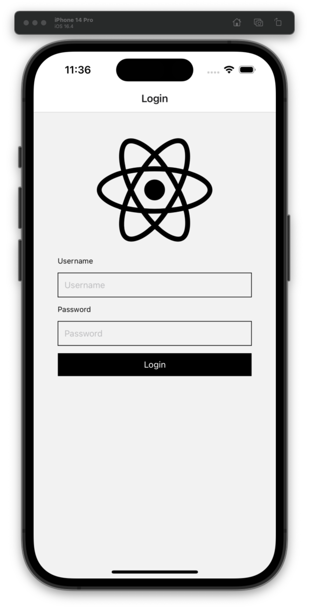
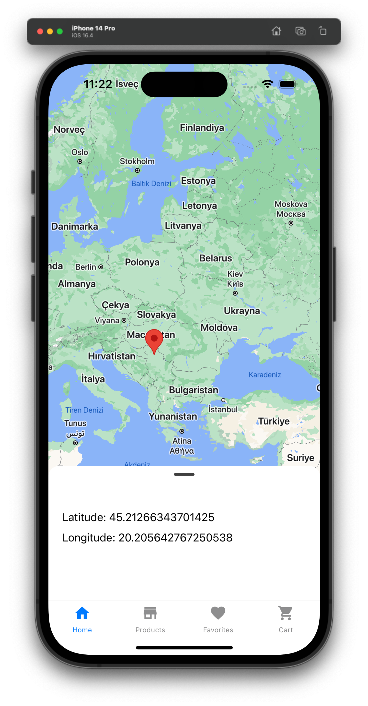
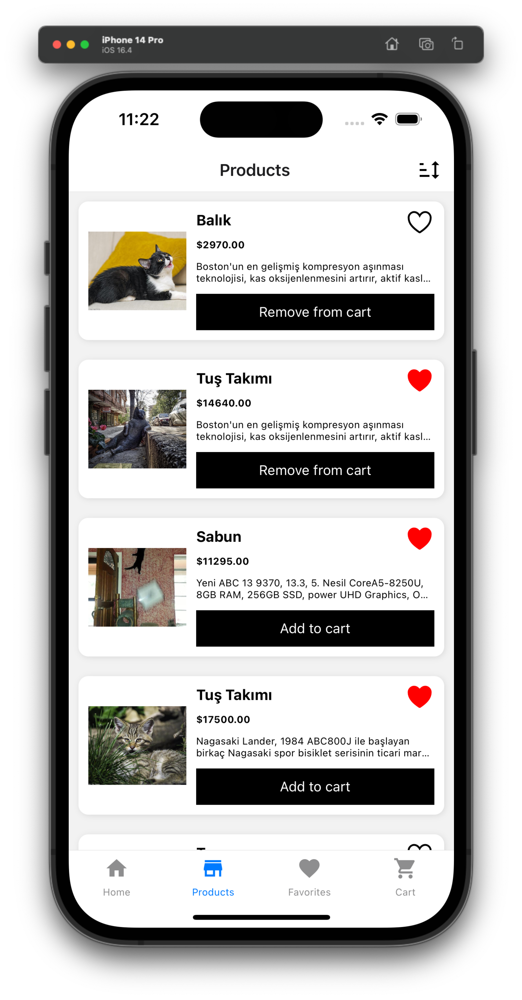
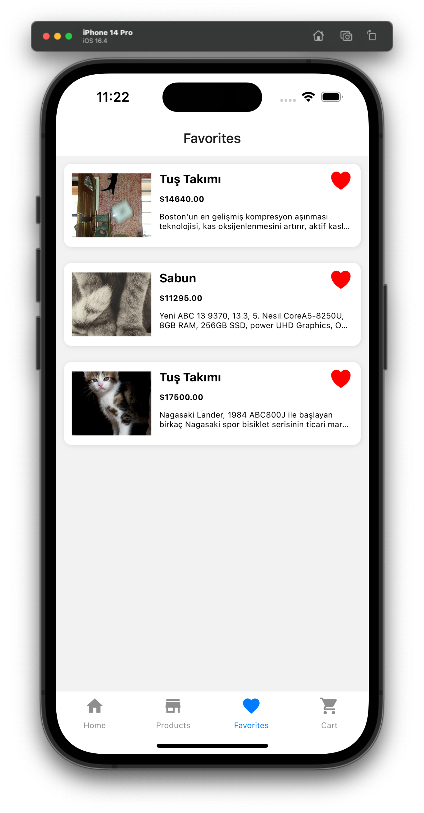
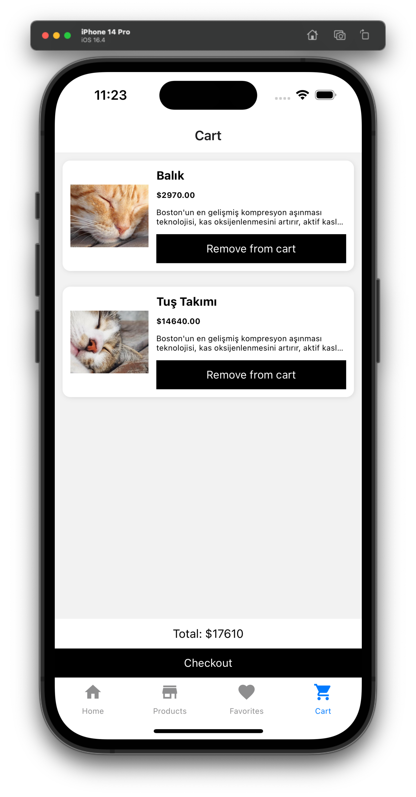

# ReactStore

## Description

This is a simple react native app that allows users to view a list of products and add them to a cart. The app uses redux to manage state and react navigation to navigate between screens. The app also uses react native paper to style the UI.

## Installation

You can clone this repo and run the following commands in the root directory of the project:

```bash
yarn install
npx expo start
```

This will start the expo server and open a browser window with a QR code. You can then scan the QR code with your phone to open the app on your device.


## Screenshots






